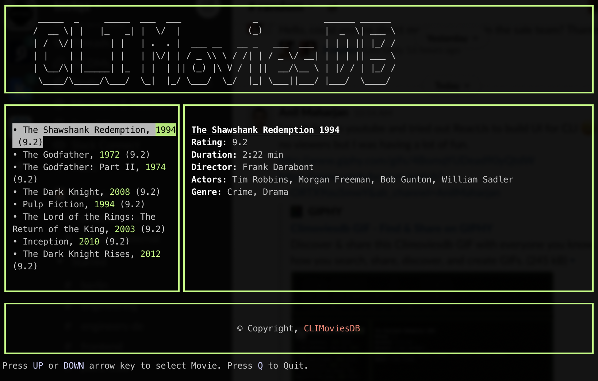

# react-ink-live

This is an example implementation of CLI Movies DB. It was a part of React on CLI Live stream on YouTube

Recording of live stream here:
https://www.youtube.com/watch?v=N0xIUUBTeBw



## Install

```bash
$ npm install --global react-ink-live
```

## Running with NPX

```bash
$ npx react-ink-live
```
